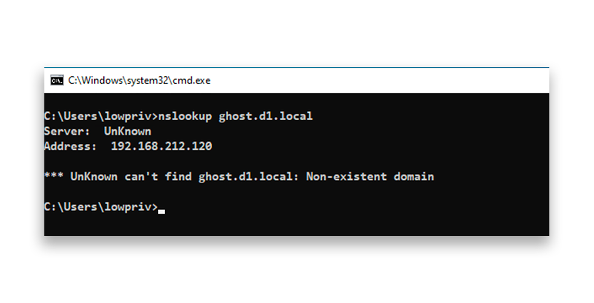
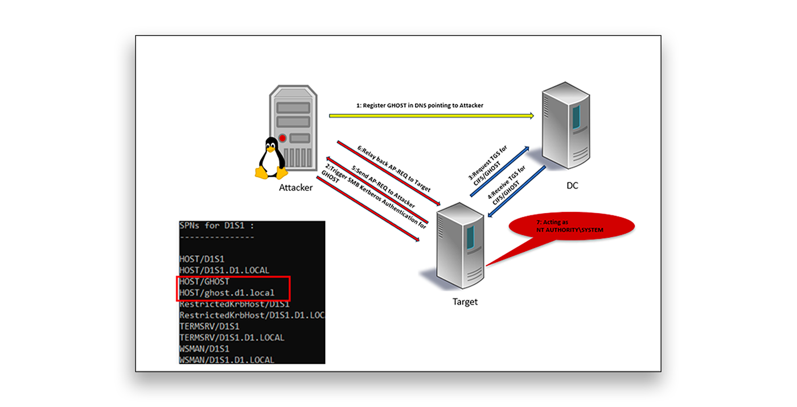
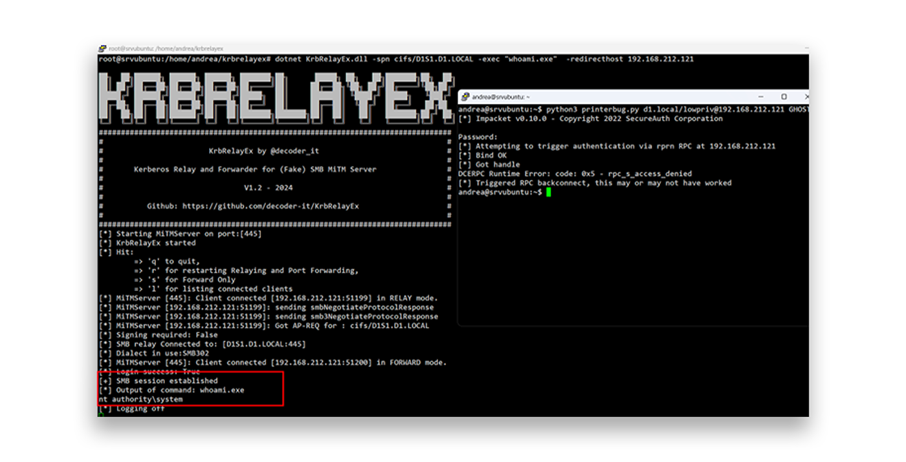
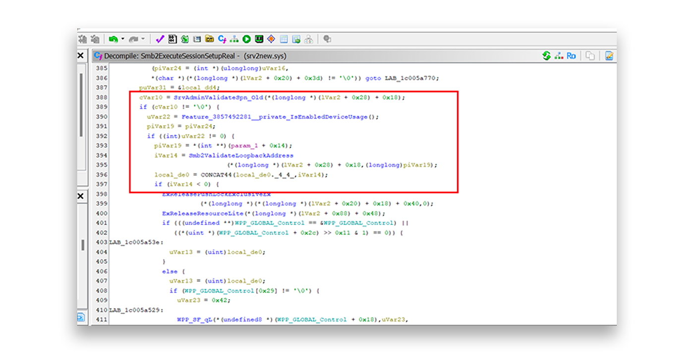

# Key findings

- **Kerberos authentication reflection** can be abused for remote privilege escalation, even after applying the fix for CVE-2025-33073.  
- **Ghost SPNs** (Service Principal Names mapped to hostnames that fail to resolve) introduce an exploitable attack surface that adversaries can leverage.  
- **Default Active Directory (AD) settings** allow standard users to register DNS records, enabling this attack, which Microsoft has cataloged as **CVE-2025-58726 (SMB Server Elevation of Privilege)**.  
- **Failure to enforce SMB signing** is a critical enabler.  
- The attack works on **all Windows versions** unless SMB signing is required.  
- Microsoft addressed this issue in the **October 2025 Patch Tuesday**.

Kerberos is widely used for secure authentication in Windows environments. However, when misconfigured Service Principal Names (SPNs) and default permissions align, attackers can exploit Kerberos reflection to gain SYSTEM-level access remotely.

We reported these findings to the Microsoft Security Response Center (MSRC) in June 2025. Microsoft released a security update for the issue, which it cataloged as **CVE-2025-58726 (SMB Server Elevation of Privilege)**, in October 2025. However, understanding how attackers seek to exploit gaps in SPN and authentication security could help you avoid similar vulnerabilities in the future.

---

## Background

When **CVE-2025-33073** was disclosed, I wondered whether authentication reflection could still be abused after the patch. That exploit used the so-called *CredMarshal trick* to enable authentication reflection and relay using Kerberos or NTLM.

Over the past few years, I’ve spent time digging deeper into authentication relay and reflection, particularly around the Kerberos protocol. Although many of these techniques are long standing and well known, there is still room for new attack methods.

---

## What is authentication reflection?

Authentication reflection occurs when an attacker captures an authentication request from a victim (machine or user) and reflects or replays that authentication back to the victim’s own service. The attack tricks the victim into authenticating to itself, enabling the attacker to escalate privileges, even without knowing credentials.

Although NTLM reflection has been mitigated for many years, Kerberos lacks a universal reflection-detection mechanism. Requiring control of the target SPN and valid Kerberos tickets makes such attacks substantially harder to exploit in practice.

---

## What are Ghost SPNs?

Ghost SPNs are SPNs that reference hostnames that are not registered in DNS. These SPNs can occur for multiple reasons:

- Legacy or decommissioned hosts or aliases, where SPNs can remain in AD even though the hostname no longer resolves, especially if cleanup scripts or procedures weren’t run.  
- Pre-staged SPNs for future services.  
- Typos or misconfigurations in deployment scripts.  
- Cross-forest or hybrid setups with unreachable hosts.  
- Load balancer names that are not directly resolvable via DNS.

---

## Attack prerequisites

The following factors enable the exploitation of **CVE-2025-58726**:

- Low-privilege user access to an AD domain.  
- A domain-joined Windows target machine on which **SMB signing is not enforced**.  
- A **Ghost SPN** that is configured for `HOST/...` or `CIFS/...` on the target machine.  
- The ability to **register DNS records** (the default for domain users in AD).

---

## Abusing Ghost SPNs

If Ghost SPNs are present, a standard user can perform a remote privilege escalation by performing a Kerberos reflection attack using a registered Ghost SPN that is configured in the target computer account.

For example, Figure 1 shows a computer account `D1S1` that has an SPN named `GHOST`.

**Figure 1:** A Ghost SPN  
  
[Voir l'image en pleine taille (Figure 1)](screenshot-ghost-spns-figure-1.png)

This SPN references a hostname that cannot be resolved via DNS (Figure 2).

**Figure 2:** A Ghost SPN that can’t be resolved with DNS  
  
[Voir l'image en pleine taille (Figure 2)](2.png)

A standard user can, by default, create DNS records. So, it is possible to register the `GHOST` server (Figure 3).

**Figure 3:** DNS update registering the `GHOST` server  
  
[Voir l'image en pleine taille (Figure 3)](3.png)

By registering a Ghost SPN in DNS that points to an IP address that an attacker controls, the attacker can cause the target machine to authenticate to the attacker’s host.

After the attacker remotely triggers the authentication, the target requests a Ticket Granting Server (TGS) service ticket for the Ghost SPN. This ticket maps to the target’s own computer account. Because that authentication is received as the computer account (which the OS maps to **SYSTEM** on the target), the attacker can then capture and relay the AP-REQ back to the target, ultimately obtaining full administrative privileges on the machine (Figure 4).

**Figure 4:** Using the registered `GHOST` server to request a TGS service ticket  
  
[Voir l'image en pleine taille (Figure 4)](4.png)

If the compromised host is a Tier 0 asset, such as an Active Directory Certificate Services (AD CS) server, this attack can be escalated to achieve full domain compromise.

---

## Attack walkthrough

In an attack exploiting **CVE-2025-58726**, a bad actor would perform the following steps:

1. Identify a Ghost SPN on the target machine.  
2. Register a DNS record for the Ghost SPN pointing to the attacker machine.  
3. Use a Kerberos relay tool (e.g., KrbRelayEx) to intercept the Kerberos authentication.  
4. Trigger authentication for the target machine (e.g., using Printer Bug, PetitPotam, or similar).  
5. Relay the Kerberos ticket back to the target machine.  
6. Gain SYSTEM access via SMB and execute arbitrary commands.

Figure 5 shows an example of the attack. In this example, the attacker forces the target host to perform machine authentication through the Print Spooler (PrinterBug). The Kerberos relay SMB listener intercepts the AP-REQ and replays the ticket to the target service, allowing authentication as the machine account and remote execution of commands with SYSTEM privileges.

**Figure 5:** Machine authentication allowing remote execution of commands with high privileges.  
  
[Voir l'image en pleine taille (Figure 5)](5.png)

In the network capture, you can see that a TGS/AP-REQ was requested for SPN `CIFS/GHOST` (Figure 6).

**Figure 6:** Network capture showing a TGS request for the Ghost SPN  
  
[Voir l'image en pleine taille (Figure 6)](figure6.png)

You can also see that the account was the target computer `D1S1` (Figure 7).

**Figure 7:** Network capture revealing the target account  
  
[Voir l'image en pleine taille (Figure 7)](7.png)

This attack targets Kerberos by abusing misconfigured SPNs; it does **not** affect NTLM.

The fix for **CVE-2025-33073** (Windows SMB Client Elevation of Privilege Vulnerability) addressed a specific SMB client issue. However, the Ghost SPN attack method bypasses that fix. The vulnerability lies in Kerberos itself, which fails to prevent authentication reflection. The same approach can be applied to other protocols that rely on Kerberos.

In our **CVE-2025-58726** attack scenario, an attacker would choose SMB because the target advertised a `HOST/...` SPN, a generic, auto-registered SPN usable by many Windows services (e.g., SMB, WMI, RPC/DCOM, RDP). Protocol-specific SPNs (e.g., `HTTP/host`, `MSSQLSvc/host`) require the corresponding Kerberos ticket to be delivered to the exact service endpoint; when relayed successfully to a misconfigured service, privilege escalation may still occur.

---

## Patch analysis and mitigation strategies

After analyzing differences among components involved in SMB server functionality, I identified the mitigation for **CVE-2025-58726** in the `srv2.sys` driver. This driver implements the server-side logic for SMB protocol versions 2.0 and later (up to 3.x).

Specifically, the driver accepts an SMB packet that carries a Kerberos blob, extracts the embedded security buffer, submits that buffer to the Local Security Authority Subsystem Service (LSASS) through the Security Support Provider Interface (SSPI) API, receives a response token, and then impersonates the originating client using that token.

Without delving into implementation-level detail, Microsoft modified `Smb2ExecuteSessionSetupReal()` and introduced the new feature `Feature_3857492281__private_IsEnabledDeviceUsage()` to include the following logic:

- `SrvAdminValidateSpn_Old()` determines whether the SPN corresponds to a valid local client security context.  
- If so, the newly introduced `Smb2ValidateLoopbackAddress()` is called, returning a negative value when the connection is remote (i.e., not from a loopback address).  
- When a non-local connection is detected, the session is terminated, effectively mitigating the Ghost SPN abuse scenario (Figure 8).

**Figure 8:** Detecting and terminating a non-local connection  
  
[Voir l'image en pleine taille (Figure 8)](8.png)

Although Microsoft has addressed this specific SMB authentication reflection vulnerability, other potential abuses could leverage Ghost SPNs. Therefore, we recommend adhering to the following general best practices for securing SPNs and authentication paths:

- **Enforce SMB signing.** Require SMB signing on all domain-joined machines, not just domain controllers, to prevent unauthorized SMB message tampering and relaying.  
- **Audit and clean up SPNs.** Regularly audit SPNs, using tools like TestComputerSpnDNS scripts. Remove or correct SPNs that point to non-existent or unreachable hosts.  
- **Restrict DNS record creation.** Modify AD permissions to prevent standard users from registering arbitrary DNS records. Enforce stricter DNS write permissions.  
- **Monitor Kerberos traffic.** Use network monitoring tools to detect unusual Kerberos service ticket requests. Flag and investigate TGS requests for suspicious SPNs.  
- **Limit coercion vectors.** Patch known coercion vulnerabilities. Harden systems by disabling unnecessary services, and use Remote Procedure Call (RPC) filters to block specific authentication-triggering attack vectors.

---

## Disclosure and timeline

- **June 25, 2025:** Vulnerability submitted to the Microsoft Security Response Center (MSRC)  
- **July 22, 2025:** Microsoft confirmed the issue, classifying it as an “Important Elevation of Privilege”  
- **October 14, 2025:** A security update addressing the flaw (**CVE-2025-58726**) was released as part of Patch Tuesday

---

## References

- https://msrc.microsoft.com/update-guide/vulnerability/CVE-2025-33073  
- https://www.synacktiv.com/en/publications/ntlm-reflection-is-dead-long-live-ntlm-reflection-an-in-depth-analysis-of-cve-2025  
- https://blog.redteam-pentesting.de/2025/reflective-kerberos-relay-attack/  
- https://www.tiraniddo.dev/2024/04/relaying-kerberos-authentication-from.html  
- https://decoder.cloud/2025/04/24/from-ntlm-relay-to-kerberos-relay-everything-you-need-to-know/  
- https://msrc.microsoft.com/update-guide/vulnerability/CVE-2025-58726
